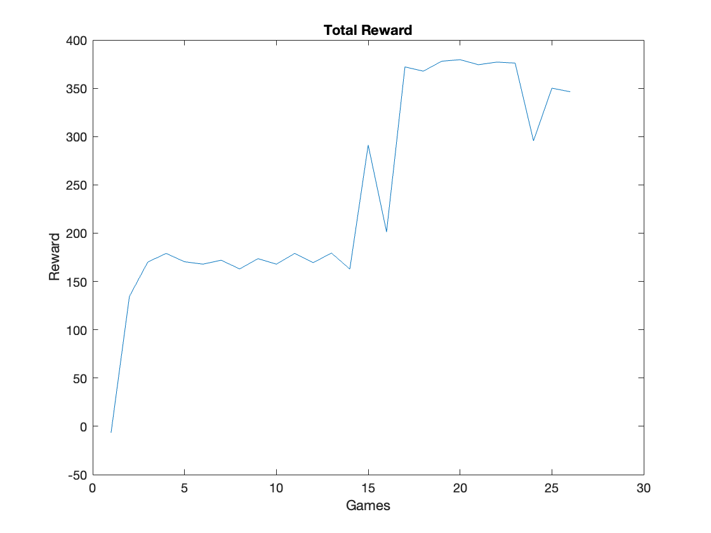
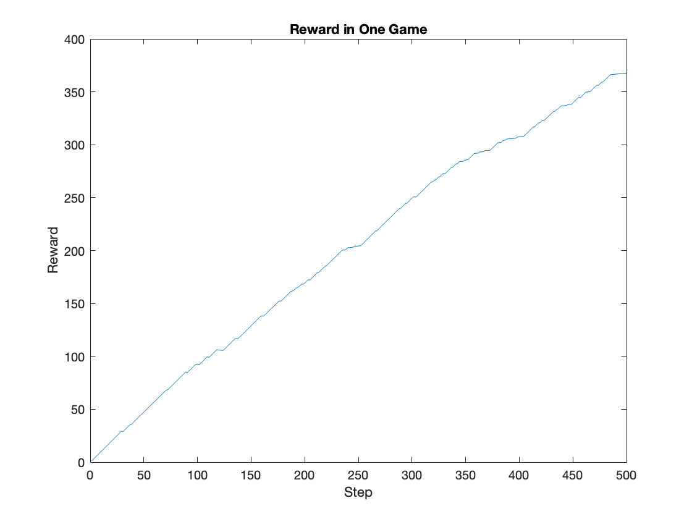

# Reinforcement-Learning-Pacman

This a open-source project done by Firefade0329. Pacman is a well-known game since last century. 
This project includes a pacman game for human player, a AI controlled pacman game using path-finding algorithm, and an AI controlled pacman game trained by Reinforcement Learning.


This README file includes:
* Video of this profect
* Performance data of Reinforcement Learning
* Explanation of the source code

Videos
======
The first video shows the AI before training. Pacman is randomly exploring.


[PreTrain.mov (before training)](Video/PreTrain.mov)


The second video shows the AI after training. Pacman is eating dots as fast as possible while keeping awway from the ghosts.


[Trained.mov (after training)](Video/Trained.mov)


Reinforcement Learning Performance
=================================
The first figure shows the total rewards gaied in each game. Pacman can get more rewards as the training process goes. After 18 games, it can mantain a reward between 300 and 400 each game.


The second figuer shows the rewards gained during a single game. Pacman is cumulating ots reward as quick as possible.



How to run
==========
To run game for human player
```
Run Pacman.java
```
To run pacman with Dijkstra pathfinding algorithm
```
Run PacmanDijkstra.java
```
To run Reinforcement Learning AI
```
Run PAcmanRL.java
```
Parameters for training such as learning factor, decay rate. radom rate can be set in
```
ReinforcementLearning/Qlearning.java
```
To train from start, set the following
```
train = true
keepTrain = false
readQ = false
```
To continue training from exsisting model, set
```
train = true
keepTrain = true
readQ = false
```
To load a traned model, set
```
train = false
keepTrain = false
readQ = true
```


Python / deep-RL edition (2026 update)
======================================
A Python port of this game plus a ladder of agents (random → hand-written rules → tabular Q-learning →
MLP / CNN / ResNet DQN) evaluated under one protocol now lives next to the original Java code, which is
unchanged.

* Start here: [`python/README.md`](python/README.md) (how to run, GPU notes), [`docs/PLAN.md`](docs/PLAN.md)
  (plan, acceptance gates, deviation log), [`docs/RESULTS.md`](docs/RESULTS.md) (auto-generated results and
  limitations), [`docs/ACCEPTANCE.md`](docs/ACCEPTANCE.md) (how to verify).
* The Java agent was re-run headless: with its default settings it scores about 160 pellets on average and
  dies in ~96 % of games. The 300+ scores in `data/Score.txt` come from other training states and do not
  represent that configuration.
* Headline (300 test games, standard ghosts): the best learned agent (an MLP on engineered features) clearly
  beats the Java agent. With 300k training steps (local GPU run) its mean is ~2 % below a careful hand-written
  planner and not significantly different from it, but equivalence or non-inferiority is *not* established (the
  confidence interval ignores training-seed variance); with 120k steps (cloud CPU run) it was ~12 % below.
  Deeper conv nets did *not* help at either budget under the default recipe; the one algorithmic finding that
  reproduced in a second run is that n-step = 1 helps the ResNet-4 a lot (it is the only depth tested with
  n-step = 1, so the depth effect under a corrected recipe is still open).
  See `docs/RESULTS.md` (cloud, 120k steps), `results_gpu/RESULTS.md` (local, 300k steps) and
  `docs/RESULTS_COMPARISON.md` (side by side, auto-generated) for numbers, ablations and caveats.

```
cd python && pip install -r requirements.txt && python -m pytest tests -q
bash scripts/acceptance.sh --quick
```
