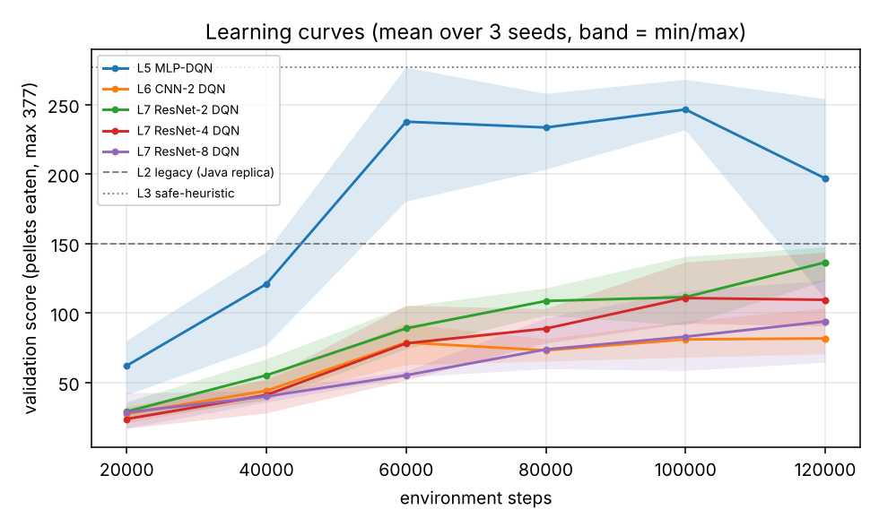
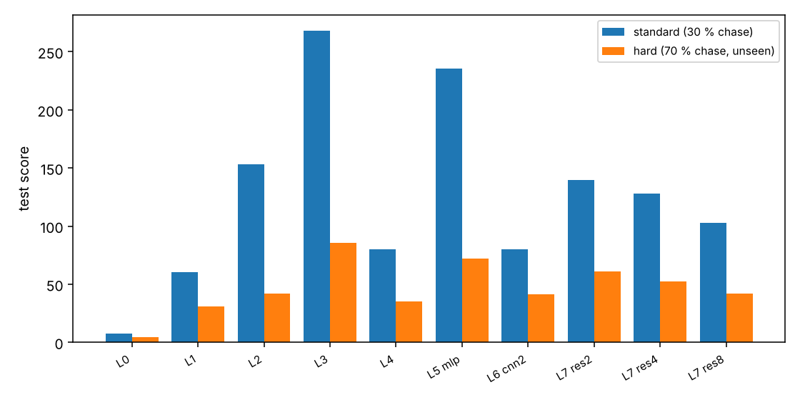

# 实验结果(由 `python/scripts/make_report.py` 从 `results/` 自动生成,请勿手改)

## 1. 怎么读这份报告
- **得分** = 吃掉的金豆数(0–377)。**死亡率** = 被幽灵抓到而结束的局占比。**通关率** = 吃光 377 个。
- 所有行都在同一批 **300 个测试种子**上评估(同起点,可配对比较);RL 行是 3 个训练种子的逐局平均。
- 神经网络的 checkpoint **仅用验证集(50 局,另一批种子)挑选**;测试集只在最终评估时用。
- 标准场景:幽灵 30% 追击(原版规则)。困难场景:70% 追击,训练中从未见过。

## 2. 对原 Java 代码的复刻校验
Original Java agent run headless (150 games, no seeds): mean score 160.5 [143.9, 177.4], death rate 96%.
复刻版 `legacy` 与之统计上不可区分(见 `python/tests/test_baselines.py::test_legacy_replica_matches_original_java_run`)。
注意:仓库里 `data/Score.txt` 中的 300+ 高分局并不代表该默认配置的真实表现。

## 3. 标准场景(测试集 300 局)
| agent | mean score [95% CI] | death rate | win rate | mean steps |
|---|---|---|---|---|
| L0 random | 7.5 [6.9, 8.1] | 100% | 0% | 41 |
| L1 greedy-BFS (no dodging) | 60.3 [54.9, 65.8] | 100% | 0% | 64 |
| L2 legacy (Java replica) | 153.4 [141.7, 165.4] | 95% | 5% | 247 |
| L3 safe-heuristic | 268.2 [254.9, 281.0] | 81% | 17% | 448 |
| L4 tabular Q (64 states) (mean of 3 seeds) | 80.3 [74.4, 86.4] | 100% | 0% | 96 |
| L5 MLP-DQN (mean of 3 seeds) | 235.7 [226.5, 244.9] | 79% | 21% | 345 |
| L6 CNN-2 DQN (mean of 3 seeds) | 80.3 [76.6, 84.0] | 100% | 0% | 110 |
| L7 ResNet-2 DQN (mean of 3 seeds) | 139.5 [134.2, 144.6] | 100% | 0% | 236 |
| L7 ResNet-4 DQN (mean of 3 seeds) | 127.8 [122.5, 133.1] | 100% | 0% | 202 |
| L7 ResNet-8 DQN (mean of 3 seeds) | 102.8 [98.2, 107.6] | 100% | 0% | 166 |

## 4. 困难场景(测试集 300 局,训练中未见)
| agent | mean score [95% CI] | death rate | win rate | mean steps |
|---|---|---|---|---|
| L0 random | 4.3 [4.0, 4.6] | 100% | 0% | 18 |
| L1 greedy-BFS (no dodging) | 31.1 [28.6, 33.8] | 100% | 0% | 32 |
| L2 legacy (Java replica) | 42.2 [39.5, 45.0] | 100% | 0% | 60 |
| L3 safe-heuristic | 85.9 [79.0, 92.8] | 100% | 0% | 106 |
| L4 tabular Q (64 states) (mean of 3 seeds) | 35.4 [32.7, 38.2] | 100% | 0% | 42 |
| L5 MLP-DQN (mean of 3 seeds) | 72.2 [68.0, 76.6] | 100% | 0% | 90 |
| L6 CNN-2 DQN (mean of 3 seeds) | 41.6 [39.7, 43.5] | 100% | 0% | 47 |
| L7 ResNet-2 DQN (mean of 3 seeds) | 61.2 [58.3, 64.2] | 100% | 0% | 74 |
| L7 ResNet-4 DQN (mean of 3 seeds) | 52.6 [49.9, 55.2] | 100% | 0% | 63 |
| L7 ResNet-8 DQN (mean of 3 seeds) | 42.0 [39.6, 44.5] | 100% | 0% | 52 |

## 5. 逐种子成绩与消融(标准场景,测试得分)
| config | seed 0 | seed 1 | seed 2 | mean ± std over seeds | val score (selection) |
|---|---|---|---|---|---|
| L5 MLP-DQN | 246.1 | 241.3 | 219.7 | 235.7 ± 14.1 | 263.5 |
| L6 CNN-2 DQN | 98.0 | 67.2 | 75.6 | 80.3 ± 15.9 | 85.0 |
| L7 ResNet-2 DQN | 133.6 | 143.4 | 141.4 | 139.5 ± 5.2 | 142.2 |
| L7 ResNet-4 DQN | 153.3 | 102.3 | 127.8 | 127.8 ± 25.5 | 124.7 |
| L7 ResNet-8 DQN | 75.2 | 89.3 | 144.0 | 102.8 ± 36.3 | 93.8 |
| res4 -nodouble | 163.6 | 100.4 | 143.4 | 135.8 ± 32.3 | 133.2 |
| res4 -nodueling | 171.6 | 147.8 | 144.0 | 154.5 ± 15.0 | 148.2 |
| res4 -nstep1 | 210.8 | 197.5 | 163.3 | 190.5 ± 24.5 | 200.3 |
| res4 raw grid (no distance fields) | 112.5 | 77.5 | 96.3 | 95.4 ± 17.5 | 101.3 |
| mlp -nodouble | 253.2 | 235.0 | 245.9 | 244.7 ± 9.2 | 264.8 |
| mlp -nodueling | 246.7 | 257.5 | 260.2 | 254.8 ± 7.1 | 267.7 |
| mlp -nstep1 | 241.3 | 239.9 | 260.6 | 247.3 ± 11.6 | 246.2 |

最终智能体(按验证得分在 5 种网络中选出):**L5 MLP-DQN**

### 消融相对完整配方的变化(配对,标准场景)
| 变体 | 基线 | 得分差(变体 − 基线) [95% CI] | 逐种子:变体高于基线的种子数 |
|---|---|---|---|
| 去掉 Double | L7 ResNet-4 DQN | +8.0 [+0.5, +15.5] | 2/3 |
| 去掉 Dueling | L7 ResNet-4 DQN | +26.7 [+19.4, +34.1] | 3/3 |
| n 步=1(去掉 n 步) | L7 ResNet-4 DQN | +62.7 [+54.8, +70.6] | 3/3 |
| 原始网格(去掉距离场) | L7 ResNet-4 DQN | -32.4 [-38.7, -26.2] | 0/3 |
| 去掉 Double | L5 MLP-DQN | +9.0 [-1.1, +19.2] | 2/3 |
| 去掉 Dueling | L5 MLP-DQN | +19.1 [+10.0, +27.9] | 3/3 |
| n 步=1(去掉 n 步) | L5 MLP-DQN | +11.6 [+1.7, +21.6] | 1/3 |

注:"逐种子"按种子编号对应(各配置的随机初始化与探索轨迹并不相同,所以只是粗略的方向一致性,不是严格配对)。CI 只反映测试局的抽样波动,**不含训练种子间的差异**;每格只有 3 个训练种子。

## 6. 曲线




## 7. 验收门槛判定(`check_acceptance.py --run-tests` 输出)
```
M1  MUST   PASS      46 passed, 1 skipped in 19.50s
M3  MUST   PASS      baselines random/greedy-bfs/legacy/safe-heuristic + tabular x3 seeds present
M4  MUST   PASS      final arch=mlp (chosen on val). score: diff +82.3 [95% CI +68.9, +95.7]; death (legacy - deep): diff +0.2 [95% CI +0.1, +0.2]; per-seed means [246.1, 241.3, 219.7] vs legacy 153.4
M5  MUST   PASS      score vs tabular: diff +155.3 [95% CI +146.3, +164.5]
M6  MUST   PASS      33 runs complete (>=3 seeds per cell)
M7  MUST   PASS      no changes to Java sources / images / Q-table since base commit
S1  SHOULD FAIL      deep vs safe-heuristic: diff -32.5 [95% CI -46.2, -18.4]; relative -12.1% (target >= -3%)
S2  SHOULD PASS      res2 vs cnn2: diff +59.2 [95% CI +53.2, +65.3]
S3  SHOULD PASS      hard: deep vs legacy: diff +30.1 [95% CI +25.7, +34.4]
S4  SHOULD REPORTED  test score by depth {cnn2: 80.3, res2: 139.5, res4: 127.8, res8: 102.8}; monotone in depth: False

MUST gates: ALL PASS
```

## 8. 未达成项与局限(定性说明,数字见上表)
- **S1 未达成**:最终神经网络(MLP)的平均得分低于强手写启发式 `safe-heuristic`,差距见第 7 节。"认真写规则"仍然更强。
- **卷积网络在 12 万步预算下没有超过 `legacy`**(第 3 节):加深并不单调有益(S4)。CNN-2 → ResNet-2 有明显提升,但 ResNet-4、ResNet-8 反而更差且种子间方差更大。深度无收益的结论**只对本预算和本超参成立**:训练曲线在结束时仍在上升,更深的网络很可能需要更多样本。
- **默认配方对卷积网络可能次优**:所有架构共用同一套超参(未逐架构调参),消融显示去掉 n 步在 ResNet-4 上得分明显更高(第 5 节),这不是事先预期的;原因目前只是假设(例如 ε-贪心探索下 n 步回报带入探索动作的偏差),**没有被实验验证**。因此"深度无收益"也可能部分源于配方而不是网络深度本身。
- **各结论的稳健性**:消融里只有"去掉 n 步对 ResNet-4 有利"和"距离场有帮助"在独立的第二套实验中复现;去掉 Dueling / Double 的效应在两套实验里符号相反。详见 `docs/RESULTS_COMPARISON.md`(两套结果的并排对比,自动生成)。
- **输入里有特权信息**:MLP 的工程特征和卷积网络的距离场都由游戏内部状态(BFS 距离)算出;原始网格对照显示距离场对 ResNet-4 有帮助。MLP 表现最好,很可能因为特征直接给出了最短路信息,而不是"神经网络更擅长"。
- **困难场景**(幽灵 70% 追击,训练中未见)下所有智能体都 100% 被抓,只能比较存活到被抓前吃到的豆数;不能说明任何智能体"学会了对付强追击"。
- **只有一张地图**,随机起点提供了状态多样性,但不能声称泛化到别的地图。
- **统计力有限**:每个配置 3 个训练种子,逐局 CI 不含种子间方差;差距较小的比较(例如 ResNet-2 与 ResNet-4)不应过度解读。
- **过程中的工程事件**(详见 `docs/PLAN.md` 偏差记录):两个卷积运行曾被内存不足杀掉后重跑;`res8_s1`、`res8_s2` 使用旧的 float32 回放(与 uint8 回放等价到 1 ulp);虚拟机被挂起后部分运行从断点续训,续训时 episode 会重新开始。被续训过的运行:res4_s0。
- **算力**:全部为 CPU、单进程 12 万步;GPU 上更长训练(见 `docs/LOCAL_GPU_RUN_PROMPT.md`)是补充实验,不在本报告内。
