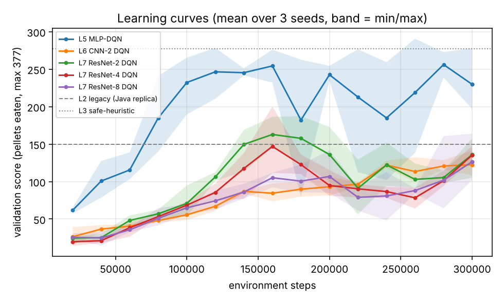
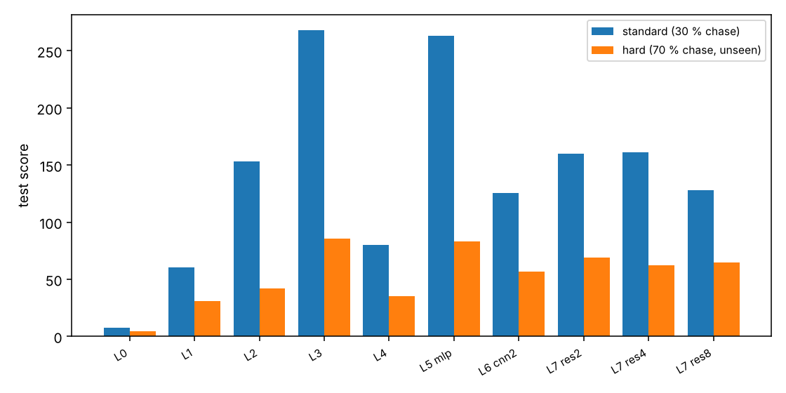

# 实验结果(由 `python/scripts/make_report.py` 从 `results/` 自动生成,请勿手改)

## 1. 怎么读这份报告
- **得分** = 吃掉的金豆数(0–377)。**死亡率** = 被幽灵抓到而结束的局占比。**通关率** = 吃光 377 个。
- 所有行都在同一批 **300 个测试种子**上评估(同起点,可配对比较);RL 行是 3 个训练种子的逐局平均。
- 神经网络的 checkpoint **仅用验证集(50 局,另一批种子)挑选**;测试集只在最终评估时用。
- 标准场景:幽灵 30% 追击(原版规则)。困难场景:70% 追击,训练中从未见过。

## 2. 对原 Java 代码的复刻校验
Original Java agent run headless (150 games, no seeds): mean score 160.5 [143.9, 177.4], death rate 96%.
复刻版 `legacy` 与之统计上不可区分(见 `python/tests/test_baselines.py::test_legacy_replica_matches_original_java_run`)。
注意:仓库里 `data/Score.txt` 中的 300+ 高分局并不代表该默认配置的真实表现。

## 3. 标准场景(测试集 300 局)
| agent | mean score [95% CI] | death rate | win rate | mean steps |
|---|---|---|---|---|
| L0 random | 7.5 [6.9, 8.1] | 100% | 0% | 41 |
| L1 greedy-BFS (no dodging) | 60.3 [54.9, 65.8] | 100% | 0% | 64 |
| L2 legacy (Java replica) | 153.4 [141.7, 165.4] | 95% | 5% | 247 |
| L3 safe-heuristic | 268.2 [254.9, 281.0] | 81% | 17% | 448 |
| L4 tabular Q (64 states) (mean of 3 seeds) | 80.3 [74.4, 86.4] | 100% | 0% | 96 |
| L5 MLP-DQN (mean of 3 seeds) | 263.3 [253.7, 272.9] | 70% | 30% | 398 |
| L6 CNN-2 DQN (mean of 3 seeds) | 125.5 [120.6, 130.3] | 100% | 0% | 174 |
| L7 ResNet-2 DQN (mean of 3 seeds) | 159.7 [154.1, 165.2] | 98% | 0% | 304 |
| L7 ResNet-4 DQN (mean of 3 seeds) | 160.9 [155.5, 166.4] | 100% | 0% | 270 |
| L7 ResNet-8 DQN (mean of 3 seeds) | 127.9 [122.0, 133.7] | 100% | 0% | 191 |

## 4. 困难场景(测试集 300 局,训练中未见)
| agent | mean score [95% CI] | death rate | win rate | mean steps |
|---|---|---|---|---|
| L0 random | 4.3 [4.0, 4.6] | 100% | 0% | 18 |
| L1 greedy-BFS (no dodging) | 31.1 [28.6, 33.8] | 100% | 0% | 32 |
| L2 legacy (Java replica) | 42.2 [39.5, 45.0] | 100% | 0% | 60 |
| L3 safe-heuristic | 85.9 [79.0, 92.8] | 100% | 0% | 106 |
| L4 tabular Q (64 states) (mean of 3 seeds) | 35.4 [32.7, 38.2] | 100% | 0% | 42 |
| L5 MLP-DQN (mean of 3 seeds) | 83.1 [78.1, 88.2] | 100% | 0% | 106 |
| L6 CNN-2 DQN (mean of 3 seeds) | 56.9 [54.0, 59.7] | 100% | 0% | 64 |
| L7 ResNet-2 DQN (mean of 3 seeds) | 69.1 [65.6, 72.6] | 100% | 0% | 86 |
| L7 ResNet-4 DQN (mean of 3 seeds) | 62.1 [58.8, 65.5] | 100% | 0% | 74 |
| L7 ResNet-8 DQN (mean of 3 seeds) | 64.4 [61.2, 67.8] | 100% | 0% | 75 |

## 5. 逐种子成绩与消融(标准场景,测试得分)
| config | seed 0 | seed 1 | seed 2 | mean ± std over seeds | val score (selection) |
|---|---|---|---|---|---|
| L5 MLP-DQN | 266.3 | 252.6 | 271.2 | 263.3 ± 9.7 | 281.9 |
| L6 CNN-2 DQN | 109.8 | 125.8 | 140.8 | 125.5 ± 15.5 | 129.4 |
| L7 ResNet-2 DQN | 175.9 | 166.7 | 136.4 | 159.7 ± 20.7 | 173.3 |
| L7 ResNet-4 DQN | 142.8 | 149.0 | 191.0 | 160.9 ± 26.3 | 161.6 |
| L7 ResNet-8 DQN | 150.8 | 129.3 | 103.7 | 127.9 ± 23.6 | 129.5 |
| res4 -nodouble | 157.8 | 138.5 | 133.9 | 143.4 ± 12.7 | 155.0 |
| res4 -nodueling | 168.6 | 131.0 | 151.7 | 150.4 ± 18.8 | 165.4 |
| res4 -nstep1 | 241.7 | 216.5 | 242.1 | 233.4 ± 14.7 | 248.1 |
| res4 raw grid (no distance fields) | 139.2 | 109.6 | 121.4 | 123.4 ± 14.9 | 128.5 |
| mlp -nodouble | 267.1 | 270.1 | 267.8 | 268.3 ± 1.6 | 282.4 |
| mlp -nodueling | 254.5 | 246.5 | 258.1 | 253.1 ± 5.9 | 283.9 |
| mlp -nstep1 | 249.3 | 244.9 | 218.5 | 237.6 ± 16.7 | 255.6 |

最终智能体(按验证得分在 5 种网络中选出):**L5 MLP-DQN**

### 消融相对完整配方的变化(配对,标准场景)
| 变体 | 基线 | 得分差(变体 − 基线) [95% CI] | 逐种子:变体高于基线的种子数 |
|---|---|---|---|
| 去掉 Double | L7 ResNet-4 DQN | -17.5 [-25.1, -9.9] | 1/3 |
| 去掉 Dueling | L7 ResNet-4 DQN | -10.5 [-18.1, -2.9] | 1/3 |
| n 步=1(去掉 n 步) | L7 ResNet-4 DQN | +72.5 [+64.3, +80.7] | 3/3 |
| 原始网格(去掉距离场) | L7 ResNet-4 DQN | -37.5 [-44.7, -30.3] | 0/3 |
| 去掉 Double | L5 MLP-DQN | +5.0 [-4.3, +14.3] | 2/3 |
| 去掉 Dueling | L5 MLP-DQN | -10.3 [-20.0, -1.0] | 0/3 |
| n 步=1(去掉 n 步) | L5 MLP-DQN | -25.8 [-36.9, -14.7] | 0/3 |

注:"逐种子"按种子编号对应(各配置的随机初始化与探索轨迹并不相同,所以只是粗略的方向一致性,不是严格配对)。CI 只反映测试局的抽样波动,**不含训练种子间的差异**;每格只有 3 个训练种子。

## 6. 曲线




## 7. 验收门槛判定(`check_acceptance.py --run-tests` 输出)
```
M1  MUST   PASS      46 passed, 1 skipped in 20.47s
M3  MUST   PASS      baselines random/greedy-bfs/legacy/safe-heuristic + tabular x3 seeds present
M4  MUST   PASS      final arch=mlp (chosen on val). score: diff +110.0 [95% CI +95.8, +123.9]; death (legacy - deep): diff +0.3 [95% CI +0.2, +0.3]; per-seed means [266.3, 252.6, 271.2] vs legacy 153.4
M5  MUST   PASS      score vs tabular: diff +183.0 [95% CI +173.4, +192.7]
M6  MUST   PASS      33 runs complete (>=3 seeds per cell)
M7  MUST   PASS      no changes to Java sources / images / Q-table since base commit
S1  SHOULD PASS      deep vs safe-heuristic: diff -4.8 [95% CI -19.7, +10.5]; relative -1.8% (target >= -3%)
S2  SHOULD PASS      res2 vs cnn2: diff +34.2 [95% CI +26.7, +41.6]
S3  SHOULD PASS      hard: deep vs legacy: diff +40.9 [95% CI +35.7, +46.2]
S4  SHOULD REPORTED  test score by depth {cnn2: 125.5, res2: 159.7, res4: 160.9, res8: 127.9}; monotone in depth: False

MUST gates: ALL PASS
```

## 8. 未达成项与局限(文字由数据决定;数字见上表)
- **S1 达成但没有超过强手写启发式**:最终神经网络(MLP)与 `safe-heuristic` 的差距在 -3% 的门槛之内,统计上难以区分(第 7 节配对置信区间),但并不比它好。
- **卷积网络**:所有卷积网络的平均得分都明显低于 MLP;平均得分高于 `legacy` 的卷积网络只有:ResNet-2 DQN、ResNet-4 DQN(差距是否显著看第 3 节置信区间)。深度并不单调有益(S4)。"深度无收益"的结论只对本报告的训练预算(300000 环境步/运行)和这一套超参成立;是否已充分训练**没有做收敛检验**(第 6 节曲线仅供参考)。
- **默认配方对卷积网络可能次优**:所有架构共用同一套超参(未逐架构调参),而消融显示去掉 n 步在 ResNet-4 上得分明显更高(第 5 节);原因目前只是假设(例如 ε-贪心探索下 n 步回报带入探索动作的偏差),**没有被实验验证**。因此"深度无收益"也可能部分来自配方,而不是网络深度本身。
- **各结论的稳健性**:云端 CPU 套与本地 GPU 套两次独立实验里,只有"去掉 n 步对 ResNet-4 有利"和"距离场有帮助"复现;去掉 Dueling / Double 的效应符号相反,不应据此取舍。详见 `docs/RESULTS_COMPARISON.md`(自动生成)。
- **输入里有特权信息**:MLP 的工程特征和卷积网络的距离场都由游戏内部状态(BFS 距离)算出;原始网格对照显示距离场对 ResNet-4 有帮助。MLP 表现最好,很可能因为特征直接给出了最短路信息,而不是"神经网络更擅长"。
- **困难场景**(幽灵 70% 追击,训练中未见)下各智能体的死亡率最低为 100%,几乎全部被抓,只能比较被抓前吃到的豆数;不能说明任何智能体"学会了对付强追击"。
- **只有一张地图**,随机起点提供了状态多样性,但不能声称泛化到别的地图。
- **统计力有限**:每个配置 3 个训练种子,逐局 CI 不含种子间方差;差距较小的比较(例如 ResNet-2 与 ResNet-4)不应过度解读。
- **算力与过程**:GPU 上的补充实验(300000 步/运行);机器信息、中断续训的运行、内存调度等过程细节见同目录 `LOCAL_RUN_REPORT.md`。被续训过的运行:mlp_s0, mlp_s1, mlp_s2, res4-nodouble_s0, res4-nodouble_s1。与云端 CPU 套的并排对比见 `docs/RESULTS_COMPARISON.md`。
